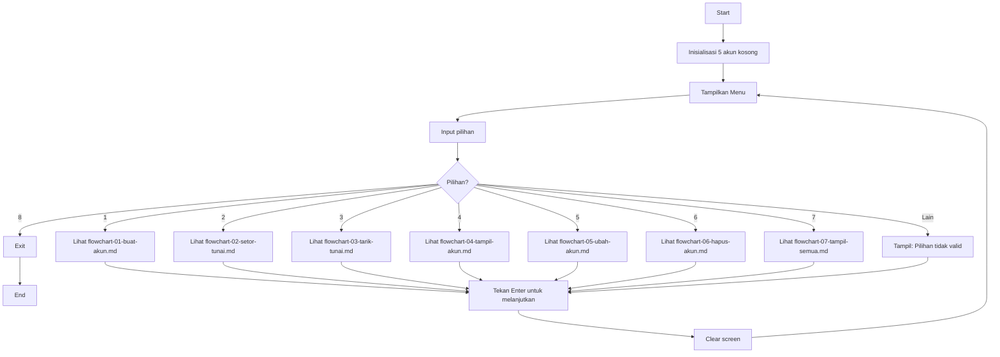

```mermaid
graph TD
    A["Start"] --> B["Inisialisasi 5 akun kosong"]
    B --> C["Tampilkan Menu"]
    C --> D["Input pilihan"]
    D --> E{Pilihan?}

    E -->|1| F["Lihat flowchart-01-buat-akun.md"]
    E -->|2| G["Lihat flowchart-02-setor-tunai.md"]
    E -->|3| H["Lihat flowchart-03-tarik-tunai.md"]
    E -->|4| I["Lihat flowchart-04-tampil-akun.md"]
    E -->|5| J["Lihat flowchart-05-ubah-akun.md"]
    E -->|6| K["Lihat flowchart-06-hapus-akun.md"]
    E -->|7| L["Lihat flowchart-07-tampil-semua.md"]
    E -->|8| M["Exit"]
    M --> N["End"]
    E -->|Lain| O["Tampil: Pilihan tidak valid"]

    F --> P["Tekan Enter untuk melanjutkan"]
    G --> P
    H --> P
    I --> P
    J --> P
    K --> P
    L --> P
    O --> P
    P --> Q["Clear screen"]
    Q --> C
```
