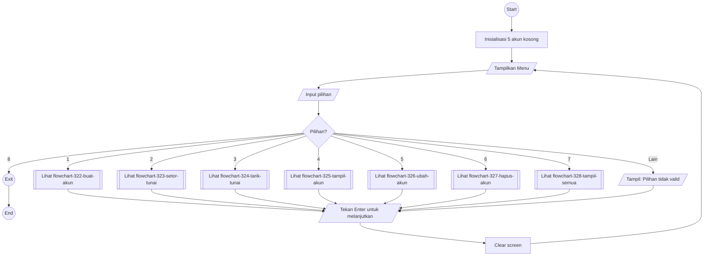

```mermaid
graph TD
    A((Start)) --> B[Inisialisasi 5 akun kosong]
    B --> C[/Tampilkan Menu/]
    C --> D[/Input pilihan/]
    D --> E{Pilihan?}

    E -->|1| F[[Lihat flowchart-322-buat-akun]]
    E -->|2| G[[Lihat flowchart-323-setor-tunai]]
    E -->|3| H[[Lihat flowchart-324-tarik-tunai]]
    E -->|4| I[[Lihat flowchart-325-tampil-akun]]
    E -->|5| J[[Lihat flowchart-326-ubah-akun]]
    E -->|6| K[[Lihat flowchart-327-hapus-akun]]
    E -->|7| L[[Lihat flowchart-328-tampil-semua]]
    E -->|8| M((Exit))
    M --> N((End))
    E -->|Lain| O[/Tampil: Pilihan tidak valid/]

    F --> P[/Tekan Enter untuk melanjutkan/]
    G --> P
    H --> P
    I --> P
    J --> P
    K --> P
    L --> P
    O --> P
    P --> Q[Clear screen]
    Q --> C
```