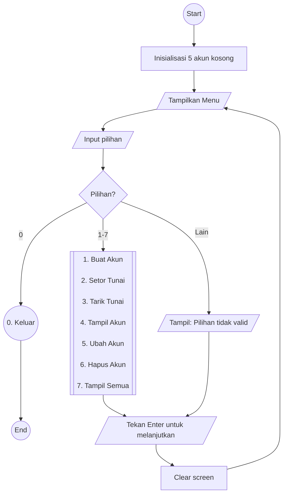

```mermaid
graph TD
    A((Start)) --> B[Inisialisasi 5 akun kosong]
    B --> C[/Tampilkan Menu/]
    C --> D[/Input pilihan/]
    D --> E{Pilihan?}

    MenuNode[[
        1. Buat Akun<br/>
        2. Setor Tunai<br/>
        3. Tarik Tunai<br/>
        4. Tampil Akun<br/>
        5. Ubah Akun<br/>
        6. Hapus Akun<br/>
        7. Tampil Semua
    ]]

    E -->|1-7| MenuNode
    
    M((0. Keluar))
    E -->|0| M

    M --> N((End))
    E -->|Lain| O[/Tampil: Pilihan tidak valid/]
    
    MenuNode --> P[/Tekan Enter untuk melanjutkan/]
    O --> P

    P --> Q[Clear screen]
    Q --> C
```
