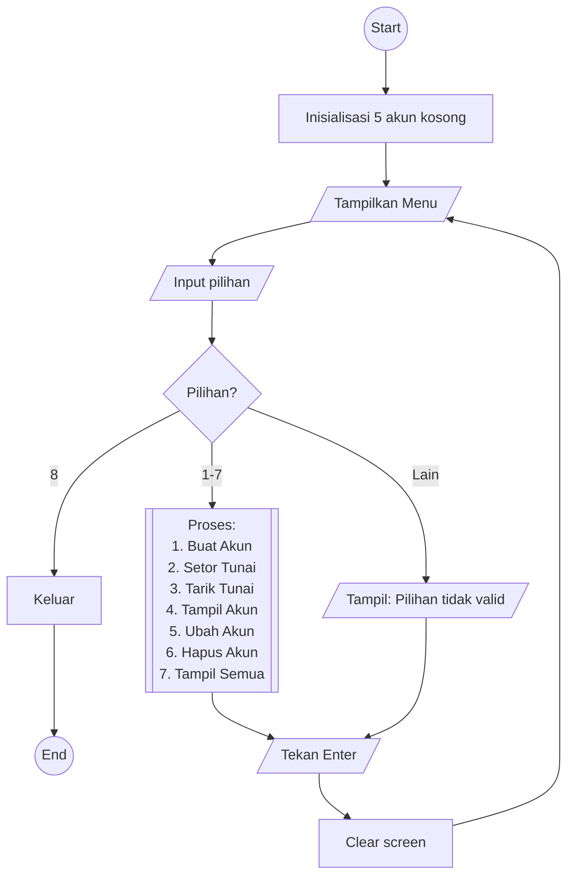

```mermaid
graph TD
 A((Start)) --> B[Inisialisasi 5 akun kosong]
 B --> C[/Tampilkan Menu/]
 C --> D[/Input pilihan/]
 D --> E{Pilihan?}

 E -->|1-7| F[[Proses:<br>1. Buat Akun<br>2. Setor Tunai<br>3. Tarik Tunai<br>4. Tampil Akun<br>5. Ubah Akun<br>6. Hapus Akun<br>7. Tampil Semua]]
 
 E -->|8| G[Keluar]
 G --> H((End))
 
 E -->|Lain| I[/Tampil: Pilihan tidak valid/]
 
 F --> J[/Tekan Enter/]
 I --> J
 
 J --> K[Clear screen]
 K --> C
```
