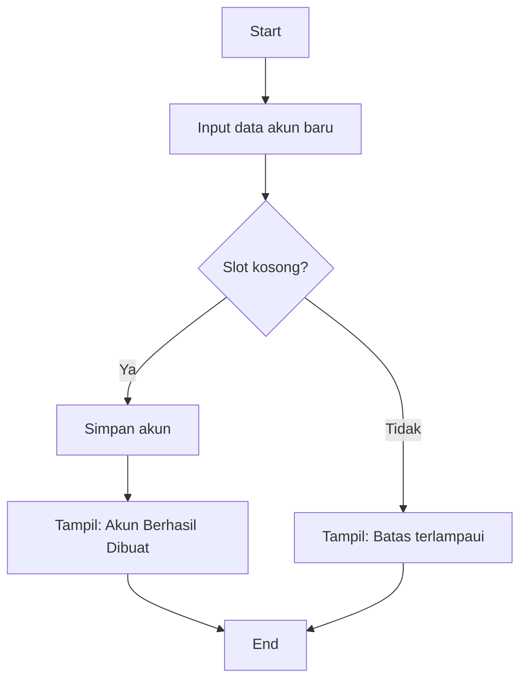

```mermaid
graph TD
    A["Start"] --> F["Input data akun baru"]
    F --> G{Slot kosong?}
    G -->|Ya| H["Simpan akun"]
    G -->|Tidak| I["Tampil: Batas terlampaui"]
    H --> J["Tampil: Akun Berhasil Dibuat"]
    J --> Z["End"]
    I --> Z
```
