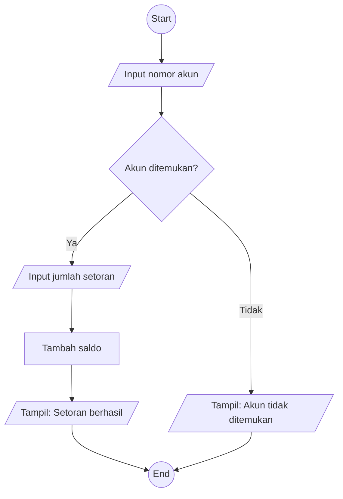

```mermaid
graph TD
    A((Start)) --> K[/Input nomor akun/]
    K --> L{Akun ditemukan?}
    L -->|Ya| M[/Input jumlah setoran/]
    M --> N[Tambah saldo]
    N --> O[/Tampil: Setoran berhasil/]
    L -->|Tidak| P[/Tampil: Akun tidak ditemukan/]
    O --> Z((End))
    P --> Z((End))
```