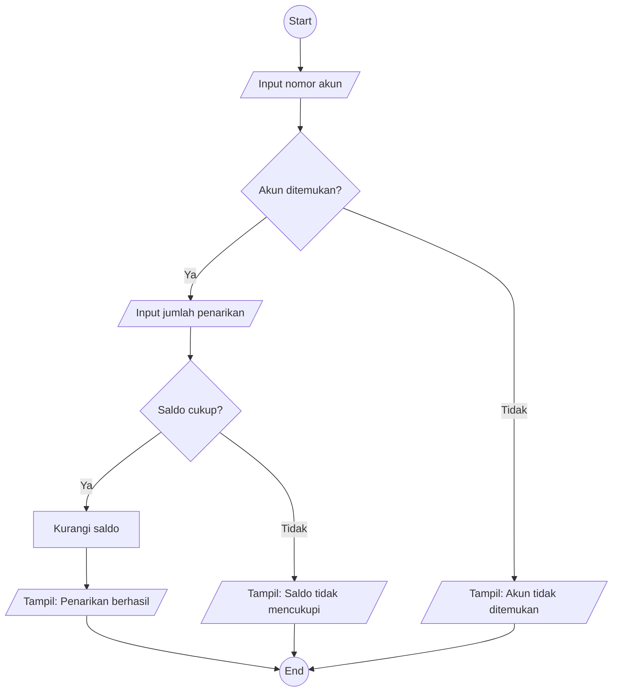

```mermaid
graph TD
    A((Start)) --> Q[/Input nomor akun/]
    Q --> R{Akun ditemukan?}
    R -->|Ya| S[/Input jumlah penarikan/]
    S --> T{Saldo cukup?}
    T -->|Ya| U[Kurangi saldo]
    U --> V[/Tampil: Penarikan berhasil/]
    T -->|Tidak| W[/Tampil: Saldo tidak mencukupi/]
    R -->|Tidak| X[/Tampil: Akun tidak ditemukan/]
    V --> Z((End))
    W --> Z((End))
    X --> Z((End))
```