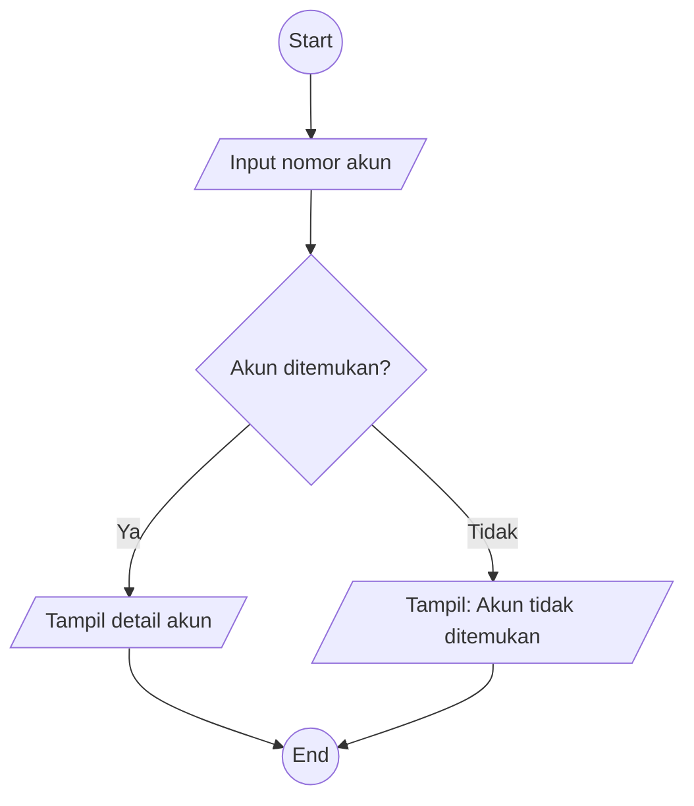

```mermaid
graph TD
    A((Start)) --> Y[/Input nomor akun/]
    Y --> Z{Akun ditemukan?}
    Z -->|Ya| AA[/Tampil detail akun/]
    Z -->|Tidak| AB[/Tampil: Akun tidak ditemukan/]
    AA --> ZZ((End))
    AB --> ZZ((End))
```