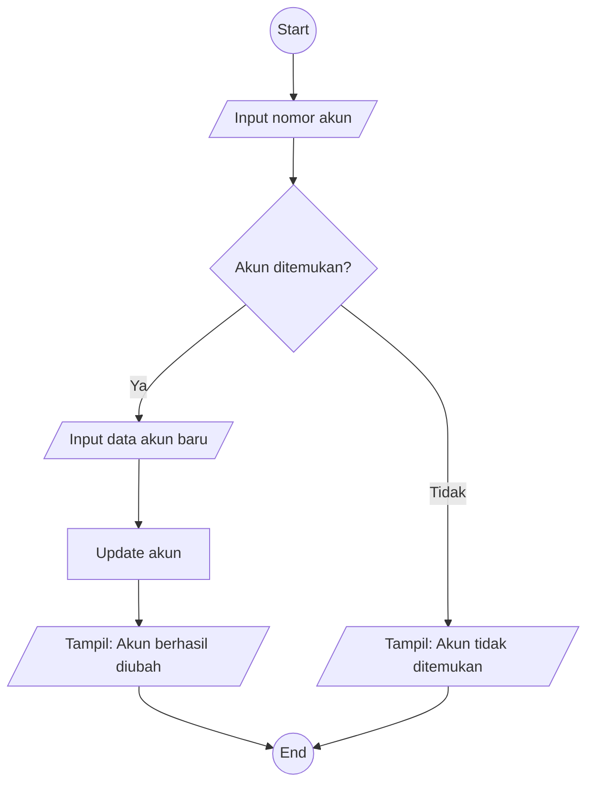

```mermaid
graph TD
    A((Start)) --> AC[/Input nomor akun/]
    AC --> AD{Akun ditemukan?}
    AD -->|Ya| AE[/Input data akun baru/]
    AE --> AF[Update akun]
    AF --> AG[/Tampil: Akun berhasil diubah/]
    AD -->|Tidak| AH[/Tampil: Akun tidak ditemukan/]
    AG --> Z((End))
    AH --> Z((End))
```