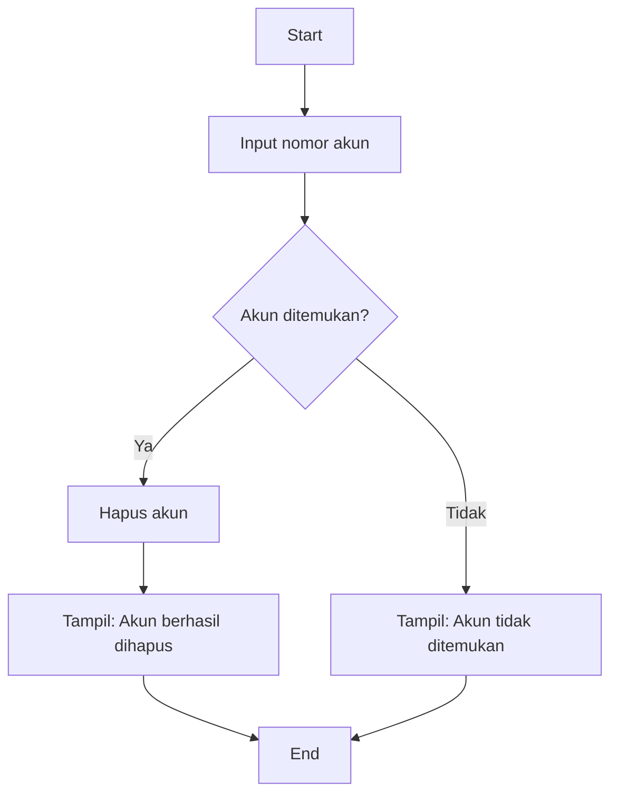

```mermaid
graph TD
    A["Start"] --> AI["Input nomor akun"]
    AI --> AJ{Akun ditemukan?}
    AJ -->|Ya| AK["Hapus akun"]
    AK --> AL["Tampil: Akun berhasil dihapus"]
    AJ -->|Tidak| AM["Tampil: Akun tidak ditemukan"]
    AL --> Z["End"]
    AM --> Z["End"]
```
