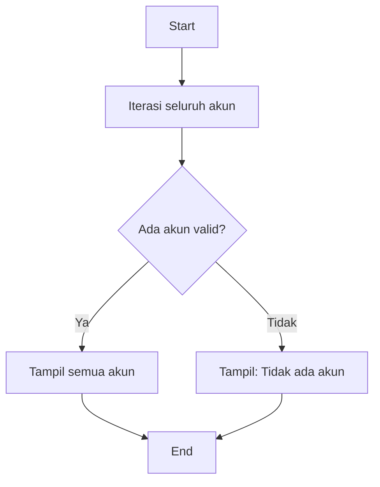

```mermaid
graph TD
    A["Start"] --> AN["Iterasi seluruh akun"]
    AN --> AO{Ada akun valid?}
    AO -->|Ya| AP["Tampil semua akun"]
    AO -->|Tidak| AQ["Tampil: Tidak ada akun"]
    AP --> Z["End"]
    AQ --> Z["End"]
```
